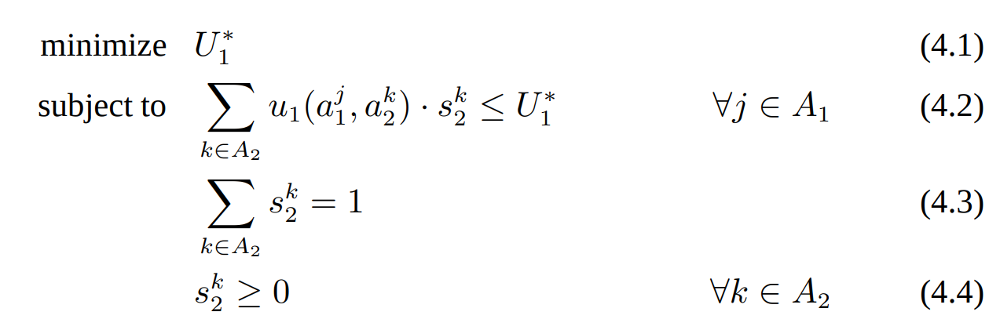

# Nash Equilibrium Solver
A simple Nash Equilibrium solver for two-player zero-sum games implemented in python.

## Usage
We include some simple examples in `examples`, feel free to run and modify.

## How to solve
The Nash equilibrium problem for two-player zero-sum games (2p0s) can be expressed as a linear program (LP), which means that equilibria can be computed in polynomial time.
However, the problem of finding a sample Nash equilibrium of a general-sum finite game with two or more players is *PPAD-complete*.

For 2p0s such as $G=(\{p1, p2\}, A_1\times A_2, (u_1, u_2))$, where $A_1$ ($A_2$) is the action set for player 1 (player 2), and $u_1$ ($u_2$) is the utility function for player 1 (player 2), we can formulate and solve the following LP to obtain the expected utility $U_1^*$ for player 1 and player 2's action probabilities $s_2^k$ at the Nash Equilibrium profile (player 1's strategy can be solved similarly):

Introduce minmax theorem here...

## References
Shoham, Yoav, and Kevin Leyton-Brown. [Multiagent systems: Algorithmic, game-theoretic, and logical foundations](https://eecs.harvard.edu/cs286r/courses/fall08/files/SLB.pdf). Cambridge University Press, 2008.
